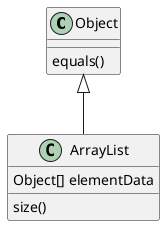

# 27 - Programación Orientada a Objetos. Objetos. Clases. Herencia, Polimorfismo. Lenguajes

* [1. INTRODUCCIÓN](#1-introducción)
* [2. CLASES Y OBJETOS](#2-clases-y-objetos)
  * [2.1. Elementos](#21-elementos)
    * [2.1.1. Atributos](#211-atributos)
    * [2.1.2. Métodos](#212-métodos)
    * [2.1.3. Constructores y Destructores](#213-constructores-y-destructores)
  * [2.2. Asociaciones](#22-asociaciones)
* [3. LOS 4 PILARES DE LA PROGRAMACIÓN ORIENTADA A OBJETOS](#3-los-4-pilares-de-la-programación-orientada-a-objetos)
  * [3.1. Encapsulación](#31-encapsulación)
  * [3.2. Abstracción](#32-abstracción)
  * [3.3. Herencia](#33-herencia)
    * [3.3.1. Clases Abstractas](#331-clases-abstractas)
    * [3.3.2. Interfaces](#332-interfaces)
  * [3.4. Polimorfismo](#34-polimorfismo)
    * [3.4.1. Sobrecarga o polimorfismo ad-hoc](#341-sobrecarga-o-polimorfismo-ad-hoc)
    * [3.4.2. Sobreescritura o polimorfismo de inclusión](#342-sobreescritura-o-polimorfismo-de-inclusión)
    * [3.4.3. Variables polimórficas](#343-variables-polimórficas)
* [4. LENGUAJES](#4-lenguajes)
  * [4.1. Javascript (Híbrido)](#41-javascript-híbrido)
  * [4.2. Java (Puro)](#42-java-puro)
  * [4.3. Python (Híbrido)](#43-python-híbrido)
  * [4.4. PHP (Híbrido)](#44-php-híbrido)
  * [4.5. C-sharp (Puro)](#45-c-sharp-puro)
* [5. CONCLUSIÓN](#5-conclusión)
* [7. BIBLIOGRAFÍA](#7-bibliografía)

## 1. INTRODUCCIÓN

El paradigma de la programación modular, divide el problema en un **conjunto de funciones que operan sobre un grupo de datos** para llegar a la solución del problema. Este paradigma permite solucionar una gran cantidad de problemas. No obstante cuando la complejidad de estos aumenta también las interrelaciones por lo que el acoplamiento entre las funciones lo hace de manera exponencial. Esto termina siendo un código muy difícil de mantener, porque no hay manera sencilla de determinar si un cambio en una función determinada afectará a otra.

Ante está problemática, surge el paradigma de la programación orientada a objetos (OOP del Inglés Object Oriented Programming) como alternativa y complemento al de la programación modular. En él se combinan funciones y datos relacionados en una unidad denominada objeto.
En este tema se estudiará, qué es la OOP y de qué elementos está compuesto. Asimismo, se expondrán los pilares más importantes de la programación orientada a objetos entre los que se encuentran: encapsulación, abstracción, herencia y polimorfismo. Para terminar se revisarán cuales son los lenguajes de programación orientados a objetos más utilizados.

Todos los ejemplos presentados en el tema se realizarán con el lenguaje de programación Java, ya que es uno de los más utilizados y representativos de este paradigma.

## 2. CLASES Y OBJETOS

La idea básica este paradigma es proporcionar modelos al programador que se **asemejen al mundo real** más que los proporcionados por la programación modular. De este modo, la unidad fundamental este paradigma es el objeto.  

El objeto está formado por un conjunto de variables (denominadas atributos) y las operaciones (denominadas métodos) que manipulan esos atributos. Una clase es el prototipo que define los atributos y métodos que van a formar parte de un determinado objeto. Es la definición abstracta de tipo de dato a partir del cual se creará la variable (objeto en este caso) en memoria.

Por ejemplo, se define la clase Coche, con una serie de atributos que pueden formar parte de un coche como puede ser: km_totales, numero_bastidor, litros_gasolina, en_marcha y unos métodos u operaciones que puede realizar como: *arranca()*, *para()*, *getNivelGasolina()*, *recorreUnKilómetro()*,*getNumeroBastidor()*. Si se crean varios objetos del tipo de esa clase, existirán variables distintas que cada una podá tener sus propios valores para esos atributos: Cada coche tendrá su propio número de bastidor (*numero_bastidor*), kilómetros totales (*km_totales*), etc. Al conjunto de todos los valores que tiene en un momento concreto cada uno de los atributos de un objeto, se le denomina **estado** del objeto.

### 2.1. Elementos

#### 2.1.1. Atributos

Son las variables o características propias de un objeto o clase. Por ejemplo, los coches tienen el número de bastidor que sería un atributo del objeto de la clase Coche. Los atributos que tienen las clases pueden ser de tipo **elemental** (entero, float, booleano,...) o de tipo **no elemental** (arrays, objetos de otras clases, etc).

#### 2.1.2. Métodos

Son la funciones y procedimientos propios de un objeto o clase. Al invocarlos desde otros objetos, o desde el mismo, se ejecuta el código que contiene con lo que se ejecutan acciones y se modifica o no el estado del objeto ( es decir, cambian los valores de sus atributos). El proceso de invocación se realiza con una sintaxis muy similar al de la programación programación modular.

```java
    objeto_coche.recorreUnKilometro();
```

La forma de invocar los métodos de un objeto es mediante el envío de mensajes. Es decir, cuando se escribe `objeto_coche.recorreUnKilometro()` en realidad esto se traduce a: envía el mensaje `recorreUnKilometro` sin ningún parámetro al objeto `objeto_coche`. Esto permite la sobrecarga de métodos, algo que veremos posteriormente en el tema.

Se distingue entre métodos y atributos de objeto y clase. Un método o atributo de objeto es una variable particular de cada instancia de la clase (es decir tiene un comportamiento distinto para cada objeto) en cambio los métodos y atributos de clase son propios de la clase. Sirven para almacenar valores como por ejemplo el número de objetos creados de un tipo.

#### 2.1.3. Constructores y Destructores

Constructores y destructores: Son métodos especiales que sirven para crear objetos de una clase (es decir reservar memoria, guardar los atributos y sus funciones en memoria e inicializarlos) y borrarlos (es decir, liberar el espacio que estaban ocupando). Algunos lenguajes de programación como Java no necesitan métodos destructores porque tienen un sistema denominado **colector de basura** que se encarga de liberar la memoria de objetos que no están siendo utilizados. Otros lenguajes como *C++* necesitan que el programador, explícitamente, indique como se ha de liberar la memoria. No obstante, desde la especificación C++11 (Aprobado por el organismo ISO en el año 2011) se incorpora plantilla std::shared_ptr que que permite al programador utilizar el colector de basura automático en determinadas partes del programa.

```java
public class Coche {
    //Atributos
    String num_bastidor;
    float km_totales;
    float litros_gasolina;
    boolean en_marcha;

    Coche(String bastidor){
        num_bastidor = bastidor;
        km_totales = 0;
        litros_gasolina = 0;
        en_marcha = 0;
    } 

    //Métodos
    void arranca(){
        en_marcha = true;
    }

    String getNumeroDeBastidor()
    {
        return num_bastidor;
    }

    //Más métodos
}
```

En el caso de Java o C\# sí que existen métodos específicos para el colector de basura, pero no tenemos ni idea de cuando se van a llamar o sí se van a llamar, por lo que no hay que confiar en que no hay que confiar en él como desencadenante de acciones.

### 2.2. Asociaciones

Las agregaciones y composiciones son tipos especiales de asociaciones entre clases donde una de las dos clases relacionadas conformaría una especie de "todo" y la otra es una parte de ese todo. La diferencia entre las dos es algo más sutil:

* **Una agregación** es un tipo de asociación donde, como hemos dicho, una de las clases es un todo y la otra una parte de ese todo. Pero se caracteriza por su independencia, es decir, si desapareciera el objeto que hace de todo, la parte podría seguir existiendo por sí misma. Por ejemplo, si tenemos una clase Biblioteca con una serie de libros, trabajadores, etc., y una clase Libro para representar cada uno de los libros de la biblioteca, la Biblioteca sería el todo, y los Libros serían una parte de ese todo, que podrían existir si la biblioteca desapareciera (simplemente, pasarían a otra biblioteca, o a particulares).
* **Una composición** es un tipo de asociación de todo-parte, donde si el todo desaparece, la parte desaparece con el todo. Por ejemplo, una casa tiene ventanas. Una clase Casa representaría el todo en esta relación, y la clase Ventana sería una parte de ese todo, pero si la casa desaparece (se destruye), las ventanas también desaparecen con la casa.

Dependiendo del lenguaje a utilizar, es posible que sólo permita reflejar uno de estos dos subtipos de asociaciones (o los dos).
En este ejemplo de agregación el coche tiene un conductor y puede tener 0 o varios pasajeros:

```java
class Coche 
{
    //...
    //Le agregamos los atributos Conductor y Pasajeros
    Persona conductor;
    Persona[] pasajero;

}
class Persona
{
    String DNI;
    String nombre;
}
```

## 3. LOS 4 PILARES DE LA PROGRAMACIÓN ORIENTADA A OBJETOS

El objetivo de la OOP es es reducir la complejidad de las soluciones y proporcionar herramientas a los programadores de forma que puedan utilizar estructuras y conceptos que se asemejen más al mundo real. Tal como se ha comentado, la unidad básica de la programación orientada a objetos es el objeto y el paradigma está fundamentado en los siguientes pilares:

### 3.1. Encapsulación

La encapsulación hace referencia a la capacidad de **combinar datos (atributos) y módulos que operan sobre esos datos (funciones) en la misma unidad funcional (objeto)**. Del mismo modo junto con la abstracción,  también proporciona los procedimientos necesarios para ocultar los atributos de manera que no sean accesibles por otros objetos y que su acceso sólo se realice a través de métodos. Los métodos utilizados para acceder a los atributos se conocen comúnmente en la jerga de OOP como getters y setters (pordría traducirse como "obtenedores" y "modificadores" de información almacenada en los atributos). La forma restringir el acceso a los métodos se describen en el apartado abstracción.

### 3.2. Abstracción

La abstracción surge como respuesta a la necesidad de reducir la cantidad de información que un programador utiliza en su trabajo de forma que determinados detalles, no relevantes para su trabajo, puedan serle ocultados.

En el ejemplo de la clase Coche, el método arranca() podría llamar a los métodos, ```abreElFiltroDelAire()```, ```calientaElMotor()```, ```abrePasoDeGasolina()```, etc. En el caso de que un programador esté implementando el sistema de remolque, sólo necesita acceder al método ```arranca()``` porque es el método que debe llamarse ya que no necesita conocer la secuencia arranque. Esto es lo mismo que le ocurre al conductor: cuando gira la llave de un coche, no necesita tener un amplio conocimiento de mecánica para que el coche arranque. En este caso, la función ```arranca()``` le abstrae la complejidad del motor.

Cómo complemento a la encapsulación, que proporciona los funcionalidad para combinar métodos con atributos en un mismo objeto, la abstracción proporciona las herramientas para restringir el acceso a determinados métodos y atributos.

Esta restricción de acceso se realiza mediante los modificadores de acceso que cada lenguaje de programación lo implementa de una manera, aunque son muy parecidos. En la siguiente tabla se detallan los modificadores de acceso para el lenguaje Java en las filas y en las columnas el ámbito de acceso, y en los campos se marca con una X donde se puede acceder.

Los ámbitos de acceso que pueden encontrarse en una aplicación Java son los siguientes:

* **Clase** - Hace referencia al propio tipo de datos
* **Paquete** - Es una estructura que se utiliza para agrupar clases relacionadas en java. El concepto es similar al de directorios o namespaces de C. 
* **Tipo Derivado (Subclase)** - Es para un nuevo tipo de dato extendiendo una definición existente (Se ve más en profundidad en el punto de herencia)
* **Mundo** Toda la aplicación donde se incluya esa clase.

|                   | Clase | Paquete | Subclase | Mundo |
| ----------------- | :---: | :-----: | :------: | :---: |
| ```public```      |   X   |    X    |    X     |   X   |
| ```protected```   |   X   |    X    |    X     |   O   |
| *sin modificador* |   X   |    X    |    O     |   O   |
| ```private```     |   X   |    O    |    O     |   O   |

**Ejemplo Coche**

```java
class Coche
{
    private boolean en_marcha;

    private abreElFiltroDelAire(){
        //...
    }
    
    private calientaElMotor(){
        //...
    }
    
    public boolean arranca()
    {
        abreElFiltroDelAire();
        calientaElMotor();
        //... 
        en_marcha=true;
        return en_marcha;
    }
}
```

Desde *Java 1.9* se incorpora un nuevo sistema de módulos que permite restringir la visibilidad a nivel de paquete y hasta incluso la búsqueda de métodos mediante reflection.

### 3.3. Herencia

La herencia es un tipo de relación entre clases que puede definirse como "es un". En el ejemplo propuesto, podría crearse la clase Vehículo con una serie de atributos  comunes a cualquier vehículo (km_totales, velocidad_actual, num_bastidor,...), podría crearse a partir de ella la clase Coche o Camión  con atributos como métodos de un coche o un camión (num_pasajeros para coche o el método soltar caja de base en el caso del camión. Con esta técnica, se ganaría que en las clases Coche o Camión no sería necesario crear de nuevo todos los atributos de vehículo porque ya estarían declarados en Vehículo si no sólo los atributos y métodos específicos de ese subtipo lo que reduciría duplicación de código.

```java
public class Vehiculo {
    protected int km_totales;
    private String num_bastidor;
    // …. más atributos, métodos y constructores
}

//la clase coche hereda de Vehículo
public class Coche extends Vehiculo
{
    //coche ya tiene todos los atributos de vehículo, ahora agregamos  los suyos
    int num_pasajeros
}

public class Camion extends Vehículo
{
    void soltarCaja(){
    //Acciones del método
}
```

La herencia es, por tanto, un mecanismo que permite reutilizar código y propiedades de una clase a otra, que normalmente añade algunas funcionalidades propias (nuevos atributos o métodos) o puede redefinir alguno de los de la clase padre. En toda herencia hay un padre (también llamado superclase), que transmite sus propiedades y métodos a un hijo (o varios, también llamados subclases). A su vez, este hijo puede ser padre y hacer heredar a otro hijo, y así sucesivamente. Esta jerarquía forma una estructura en árbol.

La herencia es unidireccional (un hijo hereda de su padre, pero no al revés), y la hay de 2 tipos principales:

1. Simple (una clase sólo puede heredar de otra, como se hace en C# o Java).
2. Múltiple (una clase puede heredar de varias, y elegir qué heredar de cada una, como se permite en C++).

La herencia múltiple no se desarrolló ni en Java ni en C# debido principalmente a la complejidad. En cambió, estos lenguajes, incorporan un tipo de estructura denominada interfaz que trae determinadas características de la herencia múltiple a estos lenguajes.

Como se verá posteriormente las interfaces junto con las clases abstractas, proporcionan herramientas para definir todo un esqueleto de una familia de clases. De esta forma, se obliga que todas las clases que pertenezcan a este modelo, tengan que cumplir con las reglas indicadas en el esqueleto.

#### 3.3.1. Clases Abstractas

En una clase normal, cuando se define un método este se ha de implementar y las subclases que hereden pueden utilizarlo o redefinirlo. Por ejemplo, puede declararse el método ```arranca()``` en clase Vehículo y que tanto coche como camión lo hereden, en este caso, ambas clases recibirían el método ```arranca()``` implementado. 

En una clase Abstracta podrían implementarse todos los métodos que interese dejando sin implementar los demás (quedarían definidos como métodos abstractos). Dichos métodos tendrían que implementarse en las clases derivadas obligatoriamente a no ser que sean también abstractas.

Este tipo de clases se utiliza cuando se quiere asegurar que todas las clases tengan un método en concreto pero que no se conozca la implementación. En el ejemplo de Vehículo, se quiere ir un paso más allá y tener dos subclases para clasificar los Vehículos: VehículoEléctrico y VehículoGasolina. En este caso, el método arrancar() definido en Vehículo pasaría a ser abstracto (con lo que vehículo quedaría como una clase abstracta) y se implementaría en VehículoEléctrico y VehículoGasolina.

```java
public abstract class Vehículo {

    public abstract void arranca();

}

public class VehículoEléctrico extends Vehículo {

    public void arranca(){
        //.. Implementación de la secuencia de arranque
    }

}

public class VehículoGasolina extends Vehículo {

    public void arranca(){
        //.. Implementación de la secuencia de arranque
    }

}
```

#### 3.3.2. Interfaces

La interfaz se declara de una manera similar a una clase Abstracta, de hecho es como una clase abstracta pero en la que todos sus métodos son abstractos. Una clase que implemente (las interfaces no se heredan, se implementan) y que no sea abstracta ha de implementar todos los métodos definidos. Una clase puede implementar múltiples interfaces pero heredar sólo de una en caso de Java. Este es el mecanismo que utilizan estos lenguajes para conseguir la herencia múltiple, es decir, el objeto hijo, se comporta como la clase padre y como todas las implementaciones a sus interfaces.

Por ejemplo, un vehículo puede tener la opción de remolque, en ese caso, se puede crear una interfaz que se llame ```OpciónRemolque`` y se utilizaría de la siguiente forma:

```java
interface OpciónRemolque {

    void engancharRemolque();
    void desengancharRemolque();

}

public class FordConRemolque extends VehículoGasolina implements OpciónRemolque{

    // No se implementa arranca porque ya está implementado en VehículoGasolina

    public void engancharRemolque(){
        // Implenentación propia
    }
    public void desengancharRemolque(){
        // Implenentación propia
    }

}
```



### 3.4. Polimorfismo

Podemos definir el polimorfismo como la capacidad de adoptar varias formas. Aplicado a la programación orientada a objetos tenemos 3 tipos de polimorfismo (los dos últimos vinculados al concepto de herencia e interfaz).

#### 3.4.1. Sobrecarga o polimorfismo ad-hoc

Consiste en tener diferentes implementaciones de un método con un mismo nombre. Puede ser que haya varias clases con un mismo método que se llame igual, o que haya métodos en la misma clase con el mismo nombre, y distinto número de parámetros. Por ejemplo, en una clase podríamos tener un método ```saludar()``` que devolviera un "Hola" genérico, y otro ```saludar(String nombre)``` que reciba un nombre como parámetro

#### 3.4.2. Sobreescritura o polimorfismo de inclusión

Consiste en definir en una clase hija o subclase el mismo método de la clase padre o superclase, pero con un código diferente y adaptado a las necesidades de la subclase. En el caso de VehículoDeGasolina podría definirse la clase Motocicleta que extiende de VehículoDeGasolina y sobreescribir el método ```arranca()``` para que coincida con cómo arranca una Moto

#### 3.4.3. Variables polimórficas

Son aquellas que pueden comportarse, dependiendo del momento del programa, como una clase concreta o como cualquiera de las subclases. Por ejemplo, una variable de tipo Vehículo podría ser un vehículo genérico en un punto del programa, y una Moto en otro punto diferente. También puede suceder que tengamos un método en una clase que reciba como parámetro un dato de tipo Vehículo, y podamos llamarlo pasándole como parámetro tanto un objeto de tipo Vehículo como de cualquier subtipo. Esto también ocurre con las interfaces.


## 4. LENGUAJES

A continuación se enumeran los lenguajes orientados a objetos más representativos utilizados actualmente según un estudio realizado por la revista RedMonk para desarrollar aplicaciones de todo tipo, agrupados según sean orientados a objetos puro o híbrido:

A partir de estudios especializados, como los que realiza la revista especializada en productos de investigador para la industria del desarrollo de software RedMonk, anualmente podemos discernir cuales son los lenguajes de programación más utilizados. Este estudio se base en las líneas de código publicadas en el principal repositorio de código del mundo, Github y en la principal foro de preguntas y respuestas sobre programación que existe.  

En base a los resultados obtenidos de revisar estas principales fuentes de información la revista ha elaborado una lista de cuales son los 5 lenguajes de programación que mayor popularidad han tenido este último semestre.

### 4.1. Javascript (Híbrido)

Sigue siendo el lenguaje de desarrollo web del cliente por excelencia, pero ahora, con la aparición del servidor Node.JS se ha trasladado también al servidor por lo que es capaz de conectarse a bases de datos y servir contenido web.

### 4.2. Java (Puro)

Es el lenguaje para desarrollo de aplicaciones más utilizado. Su versatilidad, multiplataforma y estabilidad lo han hecho idóneo para el desarrollo de aplicaciones de servidor, de escritorio y de Android. Además para el desarrollo de Servidor tiene el Framework spring

### 4.3. Python (Híbrido)

El auge que el lenguaje Python ha tenido en estos últimos años se debe, principalmente, a su facilidad de aprendizaje y uso. Es un lenguaje de alto nivel con una sintaxis muy fácilmente entendible, lo que lo convierte en un candidato muy interesante para enseñar programación en etapas intermedias (bachillerato, e incluso primeras etapas universitarias). Además, su versatilidad hace que se pueda adaptar a distintos paradigmas: imperativo, orientado a objetos, funcional... e incluso se pueden desarrollar scripts de sistemas operativos, o videojuegos, empleando dicho lenguaje.

### 4.4. PHP (Híbrido)

A pesar de que Javascript es el lenguaje de programación web por excelencia, la inmensa mayoría de aplicaciones en entorno servidor se desarrollan en lenguaje PHP con sus frameworks Laravel y Simfony. Al igual que Javascript, es un lenguaje muy flexible y fácil de aprender, y que se puede emplear tanto en su vertiente imperativa como orientada a objetos.

### 4.5. C-sharp (Puro)

En este ranking de lenguajes también tiene su hueco C#, el lenguaje por excelencia de Microsoft que, a través de la plataforma .NET, permite desarrollar también aplicaciones de distintos tipos: desde aplicaciones de consola, como de escritorio gráficas a través de WindowsForms o WPF, como aplicaciones web en entorno servidor a través de ASP.NET, e incluso aplicaciones móviles a través de su integración con Xamarin. Su principal hándicap respecto a otros lenguajes similares, como Java, reside en su dependencia de los sistemas Windows, lo que dificulta que se pueda implantar en otros sistemas (como Mac OSX o Linux). Además, existen pocos servidores web y proveedores de hosting que den soporte a las aplicaciones ASP.NET, lo que limita mucho su uso en este ámbito frente a otros lenguajes como PHP o Java.

## 5. CONCLUSIÓN

El auge sufrido por las técnicas de programación basadas en la orientación a objetos ha traído consigo desde entonces la proliferación de numerosos lenguajes orientados a objetos y técnicas de análisis y diseño asociadas. Quizá parte de este auge se deba a que las técnicas convencionales de programación estructurada y modular no han sabido dar respuesta a la resolución de ciertos tipos de problemas y aplicaciones. Con este nuevo enfoque se facilita la construcción modular y la abstracción del problema.

Todos los lenguajes orientados a objetos poseen, según lo visto, una serie de características comunes, como son el uso de clases, la ocultación de información y encapsulación, la herencia o el polimorfismo. Entre las principales ventajas que la Programación Orientada a Objetos trae consigo, podríamos citar la ocultación de información (encapsulación), la herencia para reutilizar el código de otra clase, o el polimorfismo para permitir que unos objetos puedan comportarse como otros a través de la herencia.

Por contra, los principales inconvenientes de la Programación Orientada a Objetos son el **tiempo de ejecución** (las aplicaciones orientadas a objetos suelen ser más "pesadas" en memoria y lentas), la implementación más compleja (al necesitar mayor capacidad de abstracción para representar el problema) o la necesidad de aprender numerosas librerías de clases y métodos en algunas ocasiones.

El uso de este paradigma facilita la construcción de programas mantenibles pero no la garantiza. Para la construcción de programas mantenibles es necesario utilizar algún patrón de desarrollo que ayude al programador en esta tarea. Robert Cecil Martin (Uncle Bob)

## 7. BIBLIOGRAFÍA

1. [RedMonk - Language Rankings][redmonk]
2. [4 Pillars of object Oriented Programming - Mosh](http://codewithmosh.com)
3. Código Limpio: Manual de estilo para el desarrollo ágil de software – Martin, Robert C. (Anaya Multimedia)
4. Fundamentos de Programación. Algoritmos, estrucutras de datos y objetos – Joyanes Aguilar, Luís. (MC-GrawHill)
5. JAVA 8 IN ACTION: LAMBDAS, STREAMS AND FUNCTIONAL-STYLE PROGRAMMING – Varios autores (Ed. Manning)
6. Espeficiación de Java 1.9. por Oracle.

[redmonk]: https://redmonk.com/sogrady/2019/03/20/language-rankings-1-19/